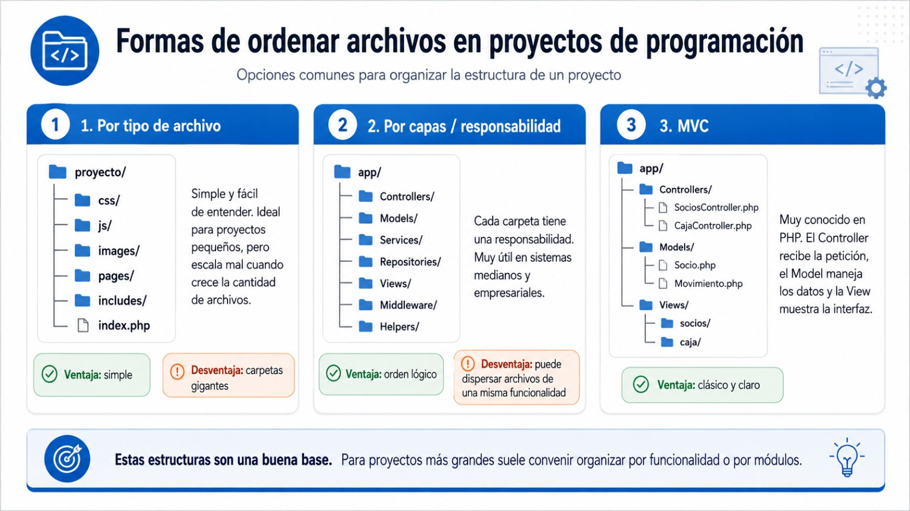
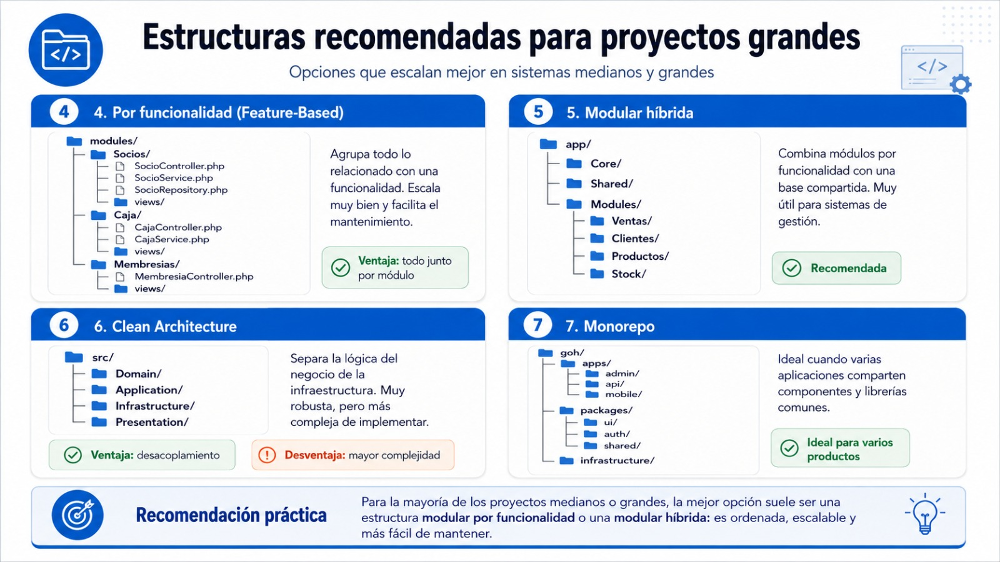

# Notas wsp

---

## Estructura de carpetas

---

Sumo tambien algunas otras formas de ordenar archivos! aunque sigo diciendo que mientras trabajen solo, busquen ustedes mismos la forma de ordenarse entre tanto lio😂 la que les quede mas comoda y practica siempre va a ser la mejor... el problema viene cuando comenzamos a compartir el codigo con colegas! Ahi aparecen algunas de estas soluciones para manejar una estructura de codigo. Estas 3 las he llegado a utilizar, la primera es mas simple...seria ordenar por tipo de archivo, las otras dos son un poco mas complejas porque ahi entran vistas, modelos y controladores que cada uno tiene su logica!

---

Y despues algunas otras que yo no llegue a usar nunca, pero si las escuche!

