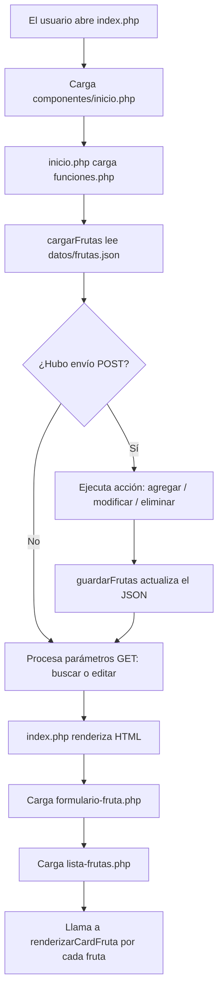

# 🍓 CRUD de Frutas con PHP, Componentes y JSON

Bienvenido/a a este proyecto pedagógico. Esta aplicación es un sistema **CRUD completo** (Altas, Bajas, Modificaciones y Búsquedas) desarrollado en **PHP puro y modular**, sin utilizar frameworks pesados ni bases de datos complejas (como MySQL). 

Toda la información se almacena de forma persistente en un archivo **JSON** y el código está organizado mediante **componentes reutilizables**.

---

## 📚 ¿Qué significa CRUD?

| Letra | Operación | En Español | ¿Dónde ocurre en el código? |
| :---: | :--- | :--- | :--- |
| **C** | **Create** | Crear / Agregar | Formulario de alta -> `agregarFruta()` |
| **R** | **Read** | Leer / Listar / Buscar | Lectura del JSON -> `cargarFrutas()` y `filtrarFrutas()` |
| **U** | **Update** | Actualizar / Modificar | Botón "Modificar" -> `modificarFruta()` |
| **D** | **Delete** | Borrar / Eliminar | Botón "Eliminar" -> `eliminarFruta()` |

---

## 📁 Estructura del Proyecto

El código está modularizado para separar la lógica de negocio, los datos y la vista visual:

```text
frutas/
├── componentes/
│   ├── card-fruta.php         # Componente: Tarjeta individual de una fruta
│   ├── formulario-fruta.php   # Componente: Formulario para agregar / modificar
│   ├── funciones.php          # Lógica: Todas las funciones auxiliares y CRUD
│   ├── inicio.php             # Controlador: Procesa peticiones (POST/GET) y prepara datos
│   └── lista-frutas.php       # Componente: Sección de frutas guardadas con la rejilla (grid)
├── datos/
│   └── frutas.json            # Base de datos: Archivo de texto en formato JSON
├── card-fruta.php             # Puente de compatibilidad a lista-frutas.php
├── estilos.css                # Hoja de estilos (CSS Grid, sombras, tarjetas y responsive)
├── index.php                  # Página principal: Orquestador limpio y visual
└── README.md                  # Documentación explicativa del proyecto
```

---

## 🚀 Flujo de Ejecución: ¿Cómo funciona paso a paso?

Cuando un usuario entra a `http://localhost/frutas/index.php`, ocurre la siguiente secuencia:



### 1. Inicialización (`inicio.php`)
* Se incluye `funciones.php` para tener disponibles todas las operaciones.
* Se ejecuta `cargarFrutas()`: si el archivo `datos/frutas.json` no existe, se crea automáticamente con las frutas iniciales de prueba (Manzana, Banana, Naranja con sus respectivas imágenes).
* Si ya existe, se lee el texto con `file_get_contents()` y se convierte en un array de PHP con `json_decode()`.

### 2. Procesamiento de acciones del usuario (`POST`)
Cuando el usuario envía un formulario (por ejemplo, al hacer clic en "Agregar", "Guardar cambios" o "Eliminar"), los datos viajan por el método `POST`:
* **Agregar (`accion = agregar`):** Verifica que el nombre y el emoji no estén vacíos, calcula un nuevo `id` autoincremental (`max(ids) + 1`), añade la fruta a la lista y guarda los cambios en el JSON con `guardarFrutas()`.
* **Modificar (`accion = modificar`):** Busca en el array la fruta que coincida con el `id` recibido, actualiza sus campos y reescribe el archivo JSON.
* **Eliminar (`accion = eliminar`):** Usa `array_filter()` para quitar la fruta cuyo ID coincide, reordena los índices con `array_values()` y guarda el nuevo array en el disco.

### 3. Filtros y preparación para la vista (`GET`)
* **Buscador (`$_GET['buscar']`):** Si el usuario escribió un texto, `filtrarFrutas()` usa `stripos()` para filtrar las frutas cuyo nombre contenga dicho texto (sin importar mayúsculas o minúsculas).
* **Edición (`$_GET['editar']`):** Si se hizo clic en "Modificar", la URL cambia a `index.php?editar=2`. La función `buscarFrutaPorId()` obtiene los datos de esa fruta específica y los carga en `$frutaEditar` para rellenar automáticamente los campos del formulario.

### 4. Presentación Visual (`index.php` y Componentes)
* `index.php` incluye el CSS (`estilos.css`).
* Se incluye el componente `formulario-fruta.php`: si `$frutaEditar` contiene una fruta, el formulario cambia su título a *"Modificar fruta"* y muestra el botón *"Guardar cambios"*; de lo contrario muestra *"Agregar una fruta"*.
* Se incluye el componente `lista-frutas.php`, el cual recorre las frutas visibles y para cada una invoca `renderizarCardFruta($fruta)`, dibujando la tarjeta de `card-fruta.php`.

---

## 🧩 ¿Qué es y cómo funciona un Componente en PHP?

Un **componente** es un archivo pequeño y especializado que se encarga de dibujar una parte puntual de la interfaz, evitando duplicar código HTML.

### Componente 1: `card-fruta.php` (Tarjeta individual)
Recibe una única fruta (`$fruta`) y genera su estructura visual:
* Si tiene enlace de imagen en `$fruta['imagen']`, genera la etiqueta ``.
* Si no tiene imagen, muestra un contenedor de respaldo con su emoji en grande (`.card-fruta-img-placeholder`).
* Muestra el icono y nombre, más los botones para modificar o eliminar.

### Componente 2: `formulario-fruta.php` (Formulario inteligente)
Contiene la tarjeta con el formulario. Detecta automáticamente si está en modo **alta** o modo **edición**:
```php
<h2><?= $frutaEditar ? 'Modificar fruta' : 'Agregar una fruta' ?></h2>
<input type="text" name="nombre" value="<?= escapar($frutaEditar['nombre'] ?? '') ?>">
```

### Componente 3: `lista-frutas.php` (Cuadrícula de frutas)
Contiene el contenedor `<section class="tarjeta">`, muestra el contador dinámico de frutas registradas y genera la cuadrícula responsiva (`.grid-frutas`).

---

## 🧠 Conceptos clave de PHP explicados para alumnos

### 1. `declare(strict_types=1);`
Obliga a PHP a respetar los tipos de datos declarados en las funciones (ej: `string`, `int`, `array`). Si intentas pasar un texto a una función que espera un número entero, PHP lanzará un error inmediato (`TypeError`), evitando fallos ocultos.

### 2. Paso por Referencia (`&$frutas`)
En PHP, cuando pasas una variable a una función, normalmente se pasa una copia. Al colocar el símbolo `&` delante del parámetro:
```php
function agregarFruta(string $archivo, array &$frutas, ...): string
```
Le indicamos a PHP que modifique directamente la lista **original** fuera de la función, sin necesidad de reasignar variables manualmente.

### 3. Persistencia con JSON y Bloqueo de Archivos
* **`json_encode($frutas, JSON_PRETTY_PRINT | JSON_UNESCAPED_UNICODE)`:** Convierte el array en texto JSON. `JSON_PRETTY_PRINT` le da formato con saltos de línea para que sea legible; `JSON_UNESCAPED_UNICODE` permite guardar emojis (`🍎`, `🍌`) y tildes sin romperlos.
* **`file_put_contents($archivo, $json, LOCK_EX)`:** Escribe el archivo en disco. La bandera `LOCK_EX` activa un **bloqueo exclusivo** para evitar que dos usuarios escriban al mismo milisegundo y corrompan el archivo.

### 4. `array_map()` vs `array_filter()`
* **`array_map`:** Transforma cada elemento del array. La cantidad final de elementos es la misma, pero con una estructura modificada:
  ```php
  // Convierte un array de frutas en un array de strings: ['🍎 Manzana', '🍌 Banana']
  $resumen = array_map(fn($f) => $f['icono'] . ' ' . $f['nombre'], $frutas);
  ```
* **`array_filter`:** Filtra elementos evaluando una condición verdadera o falsa. Solo quedan los que devuelven `true`:
  ```php
  // Conserva solo las frutas que coincidan con la búsqueda
  $visibles = array_filter($frutas, fn($f) => stripos($f['nombre'], $busqueda) !== false);
  ```

### 5. Seguridad: `escapar()` y XSS
Cualquier dato ingresado por el usuario debe limpiarse antes de mostrarse en HTML:
```php
function escapar(string $texto): string {
    return htmlspecialchars($texto, ENT_QUOTES, 'UTF-8');
}
```
Si un usuario malintencionado intenta escribir `<script>alert('hackeado')</script>`, `htmlspecialchars` lo transforma en `&lt;script&gt;...&lt;/script&gt;`, asegurando que el navegador lo muestre como texto inofensivo y no como código ejecutable.

---

## 🎨 Diseño y Estilos (`estilos.css`)

El diseño utiliza CSS moderno sin librerías externas:
* **CSS Grid (`.grid-frutas`):** Distribuye automáticamente las tarjetas en columnas responsivas según el ancho de pantalla mediante `grid-template-columns: repeat(auto-fill, minmax(220px, 1fr))`.
* **Elevación y Profundidad:** Cada tarjeta (`.card-fruta`) cuenta con un sombreado suave multicapa (`box-shadow`), y al pasar el cursor (`:hover`) se eleva con `transform: translateY(-6px)` proyectando una sombra más amplia.
* **Miniaturas con `object-fit: cover`:** Asegura que las fotos no se deformen ni pierdan su proporción original.
* **Diseño móvil (`@media`):** Adaptado para pantallas de celular menores a 520px.

---

## 🛠️ Cómo ejecutar este proyecto en tu computadora

1. Asegúrate de tener instalado [Laragon](https://laragon.org/) (o XAMPP).
2. Clona o copia la carpeta `frutas` dentro de `C:\laragon\www\frutas`.
3. Inicia los servicios de Apache desde el panel de Laragon.
4. Abre tu navegador e ingresa a:
   ```text
   http://localhost/frutas/index.php
   ```
   *(o http://frutas.test/ si usas los hosts virtuales automáticos de Laragon)*.
